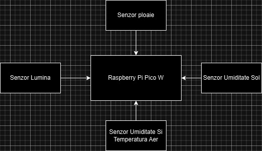

# Sistem de agricultura inteligent cu monitorizarea solului si vremii

## 1. Introducere

Proiectul constă în realizarea unui sistem de agricultură inteligent care să monitorizeze solul și vremea. Sistemul va fi capabil sa monitorizeze temperatura, umiditatea aerului si a solului, luminozitatea, daca ploua sau nu si va putea sa controleze irigarea solului.

## 2. Arhitectura

### 2.1. Hardware

Exista 2 tipuri de dispozitive: colectoare de date si dispozitive de control.

__Colectoarele__ de date sunt formate dintr-un Raspbeerry Pi Pico si diferiti senzori: temperatura, umiditate aer, umiditate sol, luminozitate, senzor de ploaie. Aceste dispozitive sunt conectate la internet si trimit datele catre un server. 

__Dispozitivele de control__ sunt formate dintr-un Raspberry Pi pico si dispozitive de control. Acestea vor fi simulate prin relee. Acestea sunt actionate atunci cand umiditatea solului sau a aerului este prea mica, temperatura este prea mare sau prea mica, luminozitatea este prea mica sau daca ploua.

### 2.2. Software

Este folosit un server REST in python care primeste datele de la colectoare si le salveaza intr-o baza de date. De asemenea, serverul primeste comenzi de la un client si le trimite catre dispozitivele de control.

### 2.3. Interfata

Pentru vizualizarea datelor este folosita platforma Grafana.

## 2.4. Schema circuitelor

### 2.4.1. Colector de date

### 3. Utilizare

### 3.1. Colector date

	* Instaleaza firmware-ul pe Raspberry Pi Pico
	* Incarca fisierul simple.py pe placuta
	* Incarca fisierul PicoDHT22.py pe placuta
	* Ruleaza data-producer/main.py

### 3.2 Dispozitiv de control

	* Instaleaza firmware-ul pe Raspberry Pi Pico
	* Incarca fisierul simple.py pe placuta
	* Ruleaza action-producer/main.py

